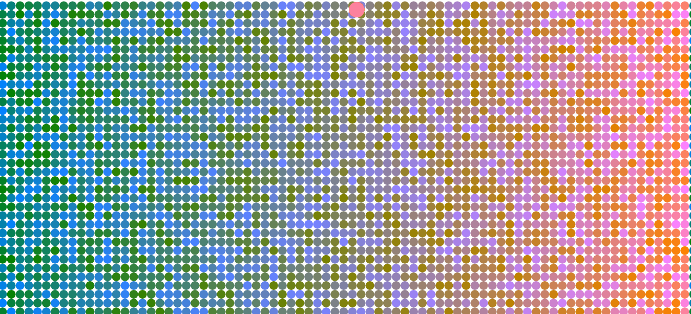
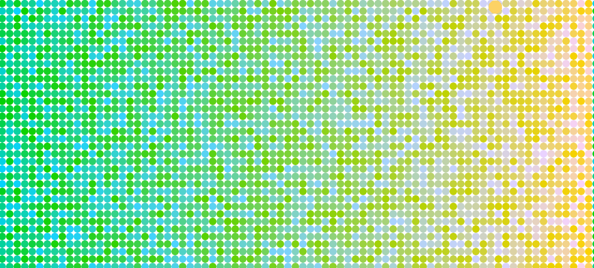

Skyler Cassady, 50

[Link to hw-8 sketch](cassadys.github.io/120-work/hw-8)

# HW 8 For and While Loops #

This week's homework is about for and while loops.  For loops can be used to repeat a command or set of commands as long as a condition is met.  For my assignment this week I used a nested for loop to make a grid of tiny circles covering the screen.

## Grid of Color Changing Ellipses ##

1. createCanvas width by height
2. set noStroke()
3. Define variables
4. set variable d to width/80 to make 80 circles
5. change 80 to variable "eighty" so number of circles can be easily changed
6. use nested for loop to make eighty circles across x axis and then add "d" to the y axis d=diameter of circle
7. ellipse color code: fill((255/eighty*i), color2, random(255));
8. ellipse draw code: ellipse(pos_x+r, pos_y+r, d);
9. ellipse x axis code: pos_x = width/eighty*i;
10. add mousePressed function to add +10 to color2 every click and reset at 255 to 0
11. ellipse to show color2 value as it is changed by clicking
    code: ellipse(((width/255)*color2), 30, 30)

## Issues ##

Had a problem with GitHub Desktop after changing computers and was unable to commit until it was resolved.  Putting the correct email address in the Git Settings fixed the problem.

Error Code: Commit failed - exit code 128 received, with output: '*** Please tell me who you are.

## Conclusion ##

Learned how to use loops to massively simplify the creation and adjustment of repetitive functions in p5.js.  Made a cool color changing disco grid that .

### Here is my sketch:

