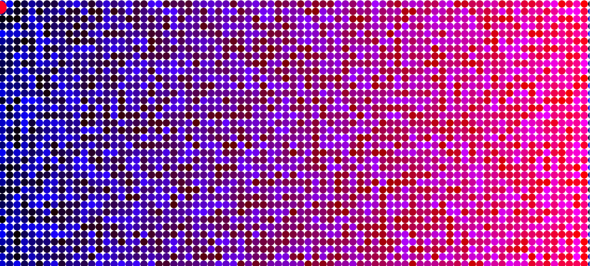
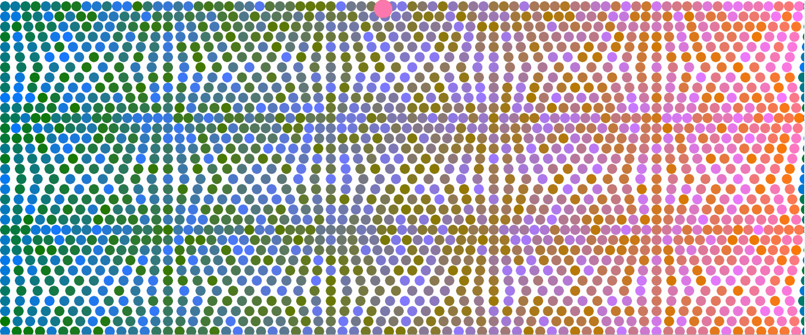
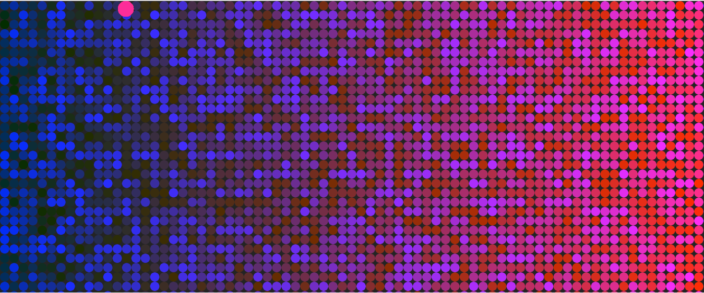
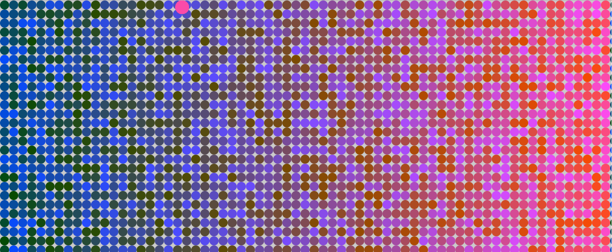
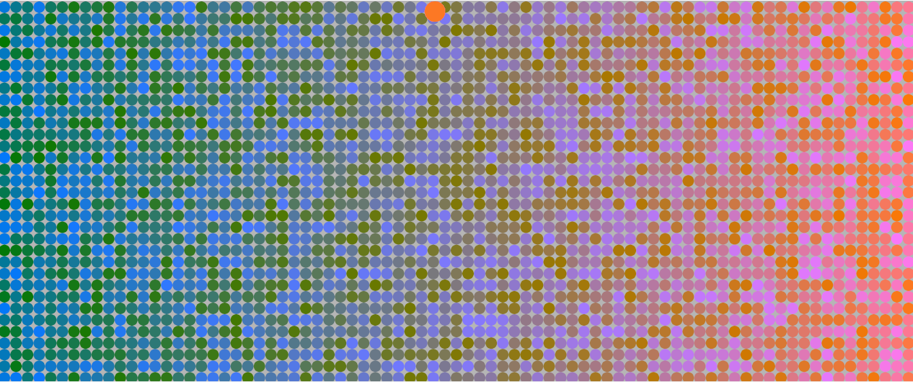

Skyler Cassady,
50

[Live Sketch Link](cassadys.github.io/120-2ork/hw-7)

# HW 10 | Modify Sketch using an Array and Formulas
### HW-7 Sketch 
## Steps to Modify HW-8 Sketch
1. Made array called eightyArray to replace the number(80) of ellipses per row in the HW-8 Sketch - values are [80 - 46 and back to 80 counted 2 at a time]
2. Made idx variable to cycle through eightyArray[idx] values in the place of the old "eighty" variables
3. Made color1 varialbe to use for a shifting background from black to white and back using (abs(color1)) counting down from 255 - -254 and resetting to 255
4. Made functions for two ellipses to slide along the y axis at the top of the sketch to represent color1 and color2 values

Depending on the X and Y coordinate of your mouse click you can change the direction and rate of movement of the ellipse.  High/low mouseX/Y values increase/decrease the rate of ball.x/y growth.

## Changes to the sketch
1. The sketch now shifts the number of ellipses per row from 80 - 46 and back to 80.
2. The background shifts from black to white and back
3. There are now two sliding ellipses to represent color2 and color1 values(where before there was only one representing color2)

## Issues
1. Had idx++ function outside of draw function and sketch malfunctioned
2. Accidentally deleted a coma between two of my array values and couldn't find my problem for a long time ><

### Screenshot of Malfunction saved code with // in sketch

### Here are screenshots of this week's sketch:

