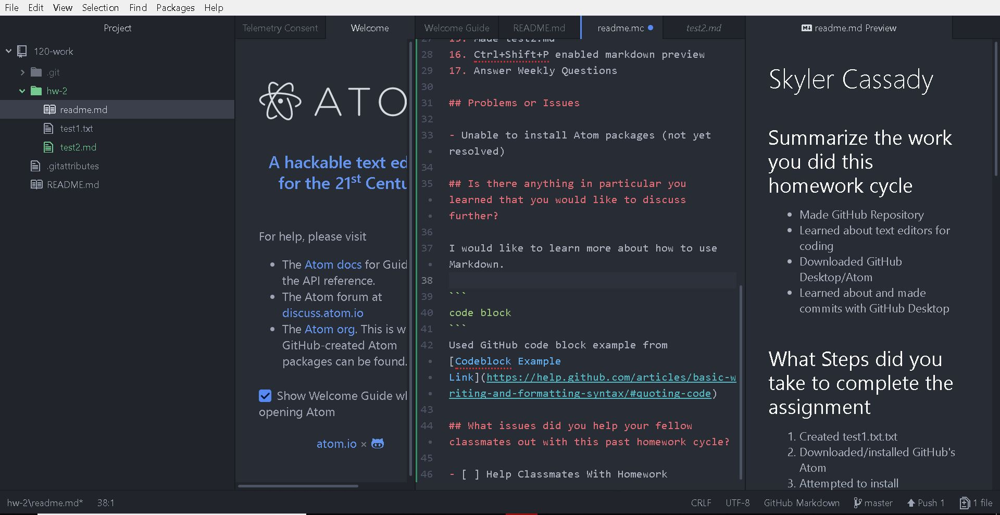

# Skyler Cassady

## Summarize the work you did this homework cycle

- Made GitHub Repository
- Learned about text editors for coding
- Downloaded GitHub Desktop/Atom
- Learned about and made commits with GitHub Desktop

## What Steps did you take to complete the assignment

1. Created test1.txt.txt
2. Downloaded/installed GitHub's Atom
3. Attempted to install recommended packages
4. Added new line to test1.txt.txt
5. Watched Git Basics
6. Downloaded/installed GitHub Desktop
7. Configured GitHub Desktop
8. Created new Repository (120-work)
9. Updated 120-work README.md with description in GitHub Desktop
10. Commented and commited change to README.md in GitHub Desktop
11. Added hw-2 directory to 120-work
12. Moved test1.txt.txt
13. committed and comment move of test1.txt.txt
14. renamed test1.txt.txt test1.txt
14. Linked GitHub.com to GitHub Desktop(published repository)
15. Made test2.md
16. Ctrl+Shift+P enabled markdown preview
17. Answer Weekly Questions

## Problems or Issues
1
- Unable to install Atom packages
- Installed 32-bit Atom and got packages installed

## Is there anything in particular you learned that you would like to discuss further?

I would like to learn more about how to use Markdown.

```
code block
```
Used GitHub code block example from [Codeblock Example Link](https://help.github.com/articles/basic-writing-and-formatting-syntax/#quoting-code)

## What issues did you help your fellow classmates out with this past homework cycle?

- [ ] Help Classmates With Homework


