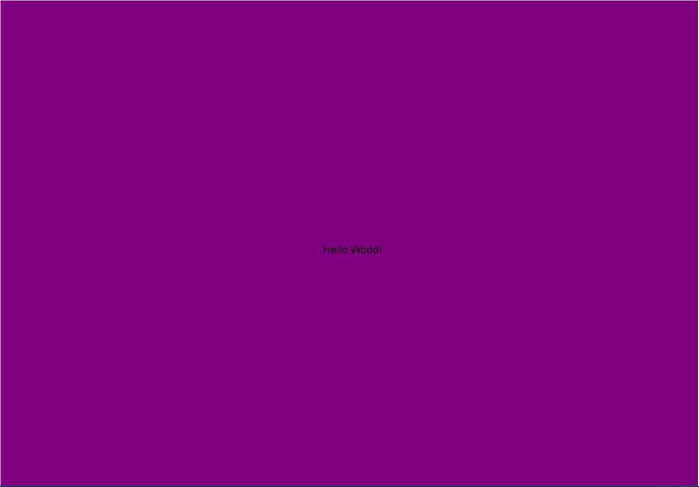

Skyler Cassady, 50

["Hello World!" Sketch](https://cassadys.github.io/120-work/hw-3/)

# Introduction
This week was about some basic p5.js functions.  Using createCanvas and draw to make a viewable web page.  Index.html explained

# Steps Taken
Used blank sketch.js to create "Hello World!" page.  Used background( 'color' ) function to change color of canvas and draw text function to write "Hello World!" and change position on canvas.

# What I Learned
I learned how to create a p5.js sketch and publish it as a web page on GitHub.  Learned about some of the uses of p5.js draw function.  How to use //comments to identify code strings.

# Issues
Had a bit of a hard time getting the canvas and background to display.  Had space in the wrong place.

# Conclusion
Very excited to be using these new tools.  Looking forward to learning more about them.

## Here is my final "Hello World!" image

