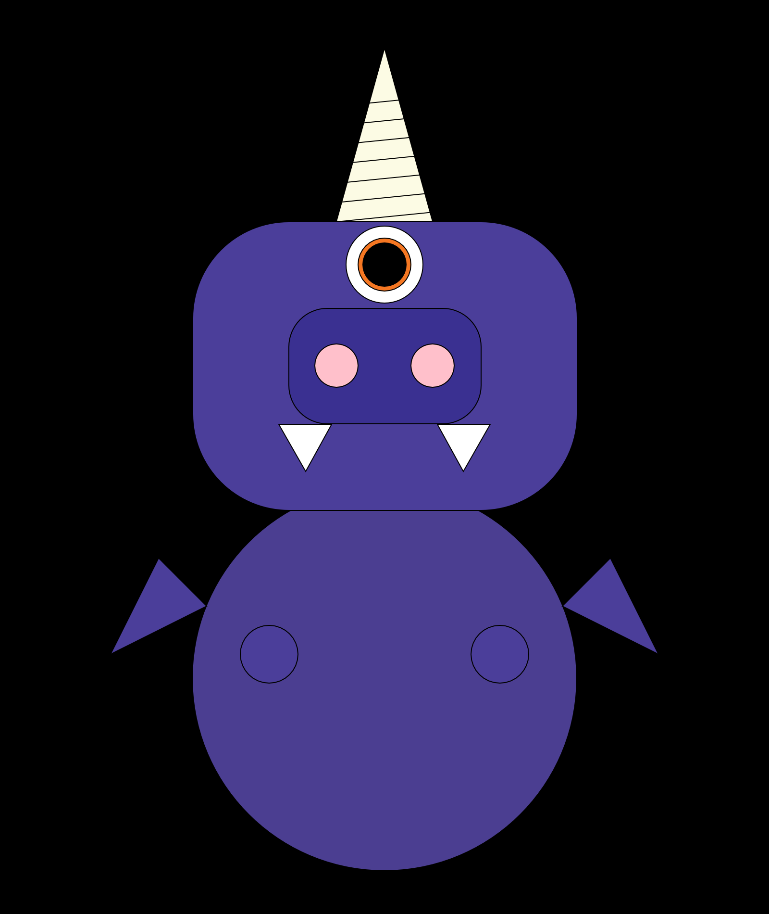

Skyler Cassady, 50

[Monster Sketch](https://cassadys.github.io/120-work/hw-4/)

# Week 4
This week we practiced with p5.js drawing functions and made our own monster or self portrait sketch in p5.js.  I chose to make a monster, the Flying Purple People Eater.

# Steps Taken
1. Made 800x950 createCanvas
2. Made background ( "black" )
2. Used rectangle function for head and nose
3. Ellipse function for body, eye, nostril, and arms
4. Triangle function for horn, teeth and wings
5. Used [Color Selector Web Page](https://www.ginifab.com/feeds/pms/pms_color_in_image.php) to select RGB colors for monster
5. Used push() pop() and translate() to move several shapes into place independantly of eachother

# What I Learned
This week's assignment has helped me understand a lot more about order of operations and context within functions.  I am starting to see how this could be used to do all kinds of different things.  I feel like I understand web pages and graphics in a whole new way now.

# Issues
Was trying to move whole shapes before fully discovering the translate() function, very glad to be able to move many things at once.  Had a problem trying to add arcs for my monster arms but couldn't figure it out and went for ellipses instead.  I am not sure what the problem was and plan to play with it more later.  Got a chance to help somebody on the message board with an error I had on hw-3.

## And now... The Flying Purple People Eater!

