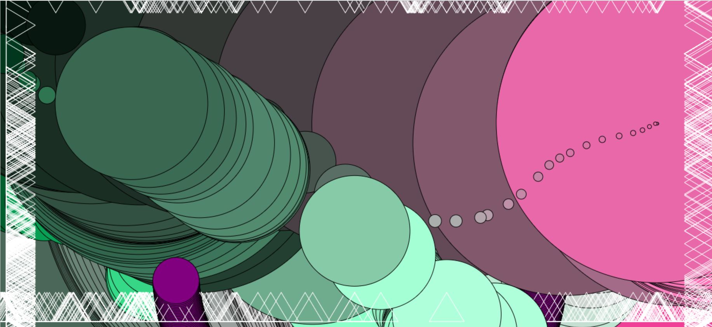
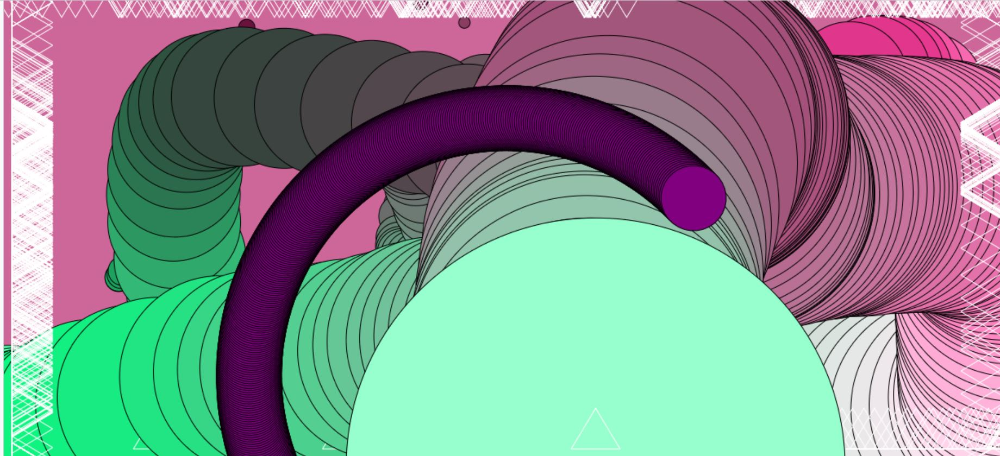

Skyler Cassady

# Week 5
This week we are learning about animation and variables.  Using the let function(let var; )to define variables.  Learning about variables and math used in coding to create change over time, using width and height and windowWidth/Height.

# Color Changing Interactive sketch
1. Made windowWidth x 600px canvas black
2. Made ellipse that follows mouse and grows by 1px every frame
3. Made another purple ellipse that rotates around an axis and moves one px every 2 frames
4. Made 4 white triangles at the edges that follow the mouse on the X axis top and bottom and Y axis left and right
5. Used variables for RGB for moving ellipse: colorY=mouseY x .425, colorX=mouseX x (255/width), colorZ=.5 x (mouseX+mouseY)
6. Used mousePressed to reset circleSize back to 1

## Conclusion

Starting to use animation variables and math in p5.js to create change over time.  Made a fun interactive painting sketch with p5.js.

### Here is my sketch:

[Link to hw-5 sketch](cassadys.github.io/120-work/hw-5)
