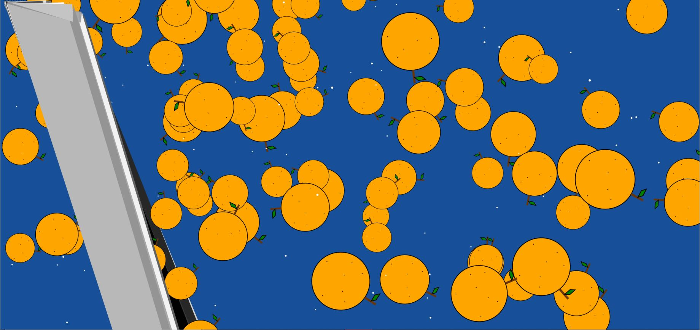
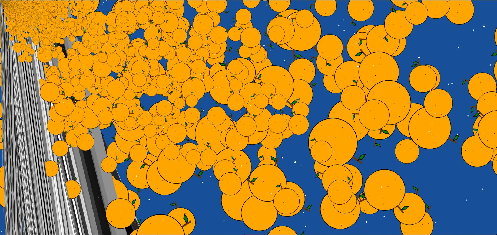
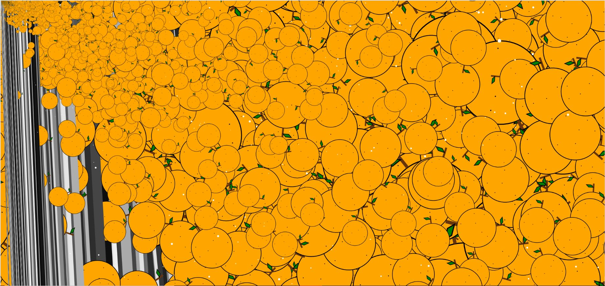

Skyler Cassady

# Week 6

This week we are learning more about math and variables.  Using order of operations, addition, subtraction, multiplication, division, and "Modulo" %.  Learning more math functions, absolute value, square root, square, constrain, celing, round and more.  Using the map function to map a set of values in one range to another range of values.

## Algorithmic Self Drawing sketch

1. Define variables
2. Made windowWidth x windowHeight canvas
3. Draw tangerine
4. Translate Tangerine to different position on screen every frame(used modulo function to screen width)
5. Rotate radians(random(360));
6. Draw variable quad every frame random 0-255 greyscale
7. Quad position random with mouse click and reset background color
8. Map mouseX and mouseY 0-255 for RGB values

## Conclusion

Using variables and algorithmic math to create change over time in a p5.js sketch.  Mapping and defining ranges and variables in the sketch.

### Here is a screenshot of this weeks' sketch

